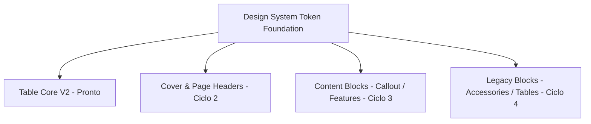

# DESIGN.SYSTEM.PARITY2 ROADMAP
**Document ID:** ROADMAP-DS-PARITY2-002  
**Status:** DRAFT (Roadmap de Convergência do Design System e Matriz de Editabilidade)  
**Escopo desta Missão (UX.TABLE.DESIGN.SYSTEM1):** Table Core V2 High-Impact + Low-Risk; Auditoria de Paridade dos Demais Componentes.  
**Branch de Referência:** `ux/table-design-system-v1`  
**Data:** Setembro/2026  

---

## 1. Visão Geral & Escopo Controlado (Emenda 22)

Para evitar desestabilização da aplicação em produção, a presente missão executou exclusivamente as entregas de **Alto Impacto e Baixo Risco**:
1. **Table Core V2**: Contrato estrito, renderizador puro, seleção de células e supressão de linhas vazias.
2. **Preset & Color System**: 12 presets canônicos (preservando os 8 existentes e restaurando `precision_blue`, `family_header`, `minimal_light`, `high_contrast`), cores HEX validadas por runtime schema e resolução unificada (`resolveTableColor`).
3. **Zero-Row & Empty-Row UX**: Supressão no Canvas/PDF com manutenção no Inspector, e placeholder editorial ("Nenhuma linha preenchida - Adicione uma linha no painel lateral").
4. **Paletas e Estilos Reutilizáveis**: Biblioteca persistida no `localStorage` com materialização direta no `TablePresentationModel` (independência de documento).
5. **Error UX**: `HumanFriendlyErrorBanner` com retry real e detalhes técnicos colapsados.
6. **Auditoria de Paridade**: Levantamento da editabilidade de todos os blocos do catálogo.

Este documento formaliza o **DESIGN.SYSTEM.PARITY2 ROADMAP** para guiar a convergência dos blocos restantes (`cover`, `header`, `features`, `text`, `callout`, `drawing`) nos próximos ciclos.

---

## 2. Matriz Completa de Editabilidade de Componentes (Component Editability Matrix)

| Componente de Bloco | Nível de Editabilidade Atual | Suporte a Custom Color | Suporte a Presets Globais | Estado no Export / PDF | Ação Recomendada (PARITY2) |
| :--- | :--- | :--- | :--- | :--- | :--- |
| **`specs_table` (V2)** | **Total (Célula / Linha / Coluna / Tabela)** | **Sim (TableColorValue / HEX / Tokens)** | **Sim (12 Presets + Saved Styles)** | **100% Paridade Canvas ↔ PDF** | **Benchmark de Produção (Concluído)** |
| `cover` (Capa do Catálogo) | Média (Título, Subtítulo, Imagem de Fundo) | Parcial (Tokens fixos do tema) | Não | Paridade com A4Canvas | Migrar para Color Tokens V2 e permitir custom overlay HEX |
| `header` / `footer` (Página) | Baixa (Texto fixo, numeração de página) | Não (Estilos herdados da página) | Não | Renderizado no rodapé A4 | Harmonizar com `presentation.borderColorToken` |
| `table` (Genérica Legada) | Alta (Colunas, linhas, overrides de texto) | Não (Cores fechadas do Tailwind) | Não | Paridade parcial | Seguir `LEGACY_TABLE_MIGRATION_PLAN.md` |
| `features` / `benefits` | Média (Adicionar/remover bullet points) | Não | Não | Ícones e texto estáticos | Criar token de acentuação visual compartilhado |
| `callout` / `warning_box` | Baixa (Texto de aviso e tipo: info/warn) | Não (Classes fixas Tailwind) | Não | Borda colorida fixa | Adotar `TableColorValue` para fundo e borda |
| `technical_drawing` | Média (Upload de SVG/PNG e escala) | N/A | N/A | Ajuste de DPI no PDF | Manter renderer atual |
| `accessories_block` | Média (Lista de acessórios e part numbers) | Não | Não | Tabela simplificada | Unificar no motor Table Core V2 |

---

## 3. Pilares da Convergência PARITY2

### Pilar A: Token Foundation Unificada
- Expandir a utilidade `resolveTableColor` para `resolveDesignSystemColor(value: ColorValue, target: 'bg' | 'text' | 'border')`.
- Compartilhar o runtime schema `HexColorSchema` em todos os blocos do catálogo.

### Pilar B: Copy / Paste de Estilo Transversal
- Estender a infraestrutura do `catalog-appearance.ts` (`copyTableAppearance`) para suportar `BlockAppearanceClipboard`:
  - Copiar estilo de um bloco `callout` para outro;
  - Copiar paleta de cores da Capa para o cabeçalho das páginas.

### Pilar C: Validação de Contraste Automática em Todos os Blocos
- Reutilizar `calculateContrastRatio` e `getContrastStatus` em qualquer componente que permita seleção livre de cor de fundo e cor de texto, impedindo catálogos ilegíveis em impressão física.

---

## 4. Fases e Cronograma do PARITY2

| Fase | Escopo | Impacto | Risco | Estimativa |
| :--- | :--- | :--- | :--- | :--- |
| **Fase 1 (Atual)** | Table Core V2 + UX Polish + Emendas 1-30 | Alto | Baixo (Isolado em specs_table) | Entregue |
| **Fase 2** | Cover & Header Color Tokenization | Médio | Baixo | 1 Sprint |
| **Fase 3** | Callouts, Features & Generic Block Colors | Médio | Baixo | 1 Sprint |
| **Fase 4** | Legacy Tables Adaptation (conforme Migration Plan) | Alto | Médio (Requer bateria de paridade) | 2 Sprints |

---

## 5. Diretrizes de Homologação Visual
- Toda melhoria implementada deve garantir zero regressão visual no exportador de PDF (`CleanA4Document`).
- A biblioteca de estilos locais (`localStorage`) deve manter retrocompatibilidade com versões anteriores através de chaveamento de versão (`version: 1`).
