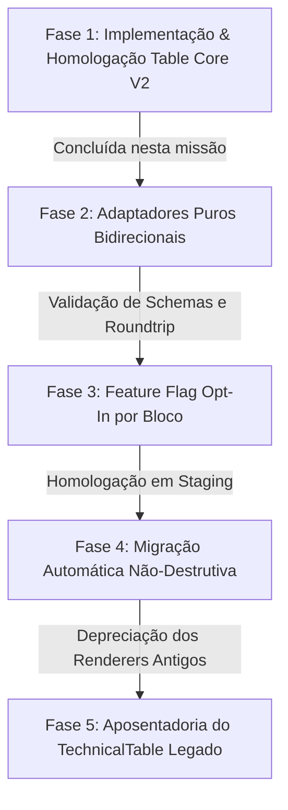

# LEGACY TABLE → TABLE CORE V2 MIGRATION PLAN
**Document ID:** ROADMAP-MIG-TABLE-V2-001  
**Status:** DRAFT (Roadmap Estrutural Aprovado para Ciclo Posterior)  
**Escopo desta Missão (UX.TABLE.DESIGN.SYSTEM1):** Specs Table (Table Core V2) Completo; Legacy Tables mantidas sem mutação arquitetural imediata.  
**Branch de Referência:** `ux/table-design-system-v1`  
**Data:** Setembro/2026  

---

## 1. Contexto & Justificativa (Emenda 1)

O diagnóstico forense e a homologação visual confirmaram a superioridade do **Table Core V2** em relação aos blocos legados (`table`, `electrical_table`, `accessories_table`, `custom_table`). Contudo, migrar compulsoriamente os editores legados em produção sem provas canônicas de:
1. **Edit Parity** (edição de células, inclusão/remoção de colunas e linhas);
2. **Save/Reload Parity** (serialização no Supabase / IndexedDB sem perda de propriedades);
3. **Export Parity** (renderização idêntica em A4Canvas, Preview e CleanA4Document/PDF);
4. **Callback Parity** (compatibilidade com seletores de blocos, inspetores e histórico de undo/redo);
5. **Zero Data Loss** (garantia matemática de 100% de preservação dos dados de catálogo).

Violaria o princípio de estabilidade de produção. Portanto, a migração dos blocos legados foi segregada nesta entrega como roadmap técnico detalhado com gates estritos.

---

## 2. Inventário de Componentes e Contratos Atuais

| Tipo de Bloco Legado | Renderer Atual | Inspector Atual | Estrutura de Armazenamento | Dependências Específicas |
| :--- | :--- | :--- | :--- | :--- |
| `table` (Genérica Legada) | `TechnicalTable` | `TableInspector` (legado) | `block.tableColumns`, `block.tableRows` | Overrides em nível de bloco |
| `electrical_table` | `TechnicalTable` | `PropertiesPanel` genérico | `block.tableColumns`, `block.tableRows` | Presets de especificações elétricas |
| `accessories_table` | `AccessoriesBlock` | Inspector customizado | `block.customData.accessories` | Preços, part-numbers e fotos de acessórios |
| `custom_table` | `TechnicalTable` | `TableInspector` | `block.tableColumns`, `block.tableRows` | Mapeamento manual de colunas |
| **`specs_table` (V2 Pilot)** | **`TableCoreRenderer`** | **`SpecsTableInspector`** | **`TableCoreBridge` + `TablePresentationModel`** | **Table Core V2 (Oficial)** |

---

## 3. Matriz de Paridade e Pré-Requisitos Canônicos de Migração

Nenhum bloco legado poderá ter seu tipo ou inspector alterado até que os 5 critérios abaixo sejam satisfeitos via testes automatizados E2E:

### 3.1. Edit Parity
- Suporte a deleção total de linhas (`rows.length === 0` com feedback editorial).
- Comportamento de supressão de linhas vazias (`isTableRowVisuallyEmpty`).
- Adição dinâmica de colunas personalizadas sem quebra do schema.
- Edição in-place vs edição via Inspector.

### 3.2. Save / Reload Parity
- Bateria de round-trip: `Legacy Block -> Adapt to Table Core V2 -> Serialize -> Deserialize -> Re-adapt -> Deep Equality`.
- Preservação estrita de `rowId`, `colKey`, snapshots de revisão e PIM datum bindings.

### 3.3. Export Parity
- Geração de PDF via CleanA4Document com divergência visual delta = 0px.
- Conformidade tipográfica (alinhamento numérico à direita, texto à esquerda, títulos centralizados).
- Omissão de tabelas 100% vazias no PDF (sem faixa de 2px fantasma).

### 3.4. Callback Parity
- Integração perfeita com `selectEditorElement({ blockId, childId })`.
- Despacho de eventos de focus e blur para auto-save.

### 3.5. Zero Data Loss
- Prova com catálogos legados reais (fixtures `cat_specs_pilot`, catálogos congelados de calibração).
- Verificação de que nenhuma propriedade `customData` órfã é descartada durante a transformação.

---

## 4. Fases de Execução do Roadmap

### Fase 1: Estabilização do Table Core V2 (Esta Missão)
- `specs_table` utiliza `TableCoreRenderer` e `SpecsTableInspector` de ponta a ponta.
- Paletas de cores customizadas, presets estendidos (12 presets), supressão de ghost rows e friendly error UX.
- Correções seguras aplicadas no legado quando suportadas (ex.: remoção da trava de exclusão da última linha).

### Fase 2: Adaptadores Puros Bidirecionais (Próximo Ciclo)
- Criação de adaptadores dedicados:
  - `adaptGenericTableToTableCore(block: ContentBlock): TableModel`
  - `adaptElectricalTableToTableCore(block: ContentBlock): TableModel`
  - `adaptAccessoriesTableToTableCore(block: ContentBlock): TableModel`
- Validação com suite de testes de round-trip.

### Fase 3: Feature Flag Opt-In por Bloco
- Introdução de chave no `customData.useTableCoreV2: boolean` em blocos legados.
- Usuário pode alternar experimentalmente no catálogo sem perder compatibilidade de rollback.

### Fase 4: Migração Automática Não-Destrutiva
- Migração transparente em tempo de leitura com fallback seguro caso ocorra qualquer erro de parse ou geometria inválida (`geometryResult.valid === false`).

### Fase 5: Aposentadoria Definitiva
- Remoção do código legado `TechnicalTable.tsx` após 2 releases de estabilidade sem incidentes em produção.

---

## 5. Critérios de Rollback & Segurança de Produção
- Se qualquer tabela apresentar perda de binding PIM ou truncamento de texto na adaptação, o fallback automático reverte imediatamente para o renderizador legado sem lançar exceções para o usuário final.
- Nenhuma migration SQL DDL/DML destrutiva será executada no banco live.
