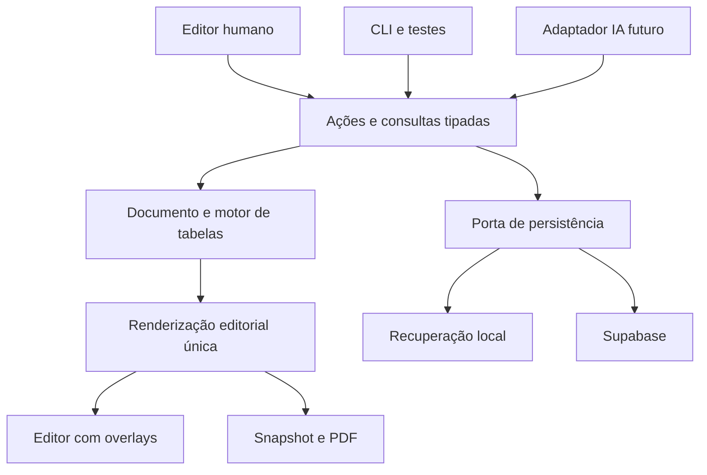

# Produto, arquitetura e contratos do documento

STATUS: APPROVED FOR FOUNDATION-PROOF-01 IMPLEMENTATION
PRINCIPAL REVIEW: APPROVED
FREEZE STATUS: FROZEN FOR FOUNDATION-PROOF-01
DATE: 2026-09-09

BASELINE: `616332d6048a4259d2e2b562d8d5e781cea334bd`

## Modelo de uso

Editor profissional de páginas finitas, com posicionamento livre entre objetos e layout previsível dentro de tabelas e caixas de texto. Um editor tipo Word simplifica fluxo longo, mas não resolve bem as composições Additel 875 p. 6. Um canvas infinito oferece liberdade, mas transfere ao usuário demasiada responsabilidade de impressão. A combinação proposta mantém a página física visível e oferece modelos prontos.

Fluxo principal: Meus catálogos → Novo a partir de modelo → Editar páginas → Conferir pendências → Salvar → Pré-visualizar → Baixar PDF. “Modelos” são páginas/catálogos editáveis; “estilos de tabela” só alteram aparência; “componentes” inserem composições reutilizáveis.

FATHER-USABLE V1 inclui texto rico, imagem, tabela, formas simples, linhas, grupos, estilos, presets/templates, Undo/Redo, recuperação local, salvamento remoto, PDF, AI Translation e basic read-only sharing. **Undo/Redo** e **local recovery** são `V1 DISPOSITION: MUST-CANDIDATE` / `DECISION STATUS: PROPOSED`: o primeiro garante reversão segura de ações editoriais e o segundo protege trabalho ainda não confirmado contra reload/crash/interrupção; nenhum deles é inferido de save/reopen. A experiência para usuário não técnico usa termos editoriais, sem exibir schema, resolver, binding, CAS ou IDs. FOUNDATION-PROOF-01 implementa apenas o subconjunto necessário para provar a fundação editorial e não é ainda essa experiência de produto.

## Canvas e interface propostos

- Barra superior: título, desfazer/refazer, status de salvamento, prévia e PDF.
- Trilho vertical: Selecionar, Texto, Imagem, Tabela, Formas, Componentes. Painel adjacente alterna Páginas/Modelos/Arquivos. Preservar paleta e identidade PRESYS; esta é uma proposta para a nova superfície, sem redesenhar o legado.
- Centro: página A4 com zoom ajustável e “Ajustar à página”. Sem largura fixa obrigando rolagem horizontal quando há espaço para reduzir o zoom.
- Inspector contextual: Conteúdo, Posição e tamanho, Aparência. Controles de fonte, cor e borda compartilhados, com extensões específicas da tabela.
- Seleção de objeto é distinta de edição de texto/célula. Escape termina edição antes de limpar seleção. Delete não remove um objeto enquanto o foco está editando texto.

| Interação | MVP | Regra |
|---|---|---|
| Selecionar/arrastar/redimensionar | MUST-CANDIDATE | Preview transitório; um comando no término; Escape cancela |
| X/Y/largura no inspector | MUST-CANDIDATE | mm finitos; conversão por zoom apenas na entrada/saída da UI |
| Altura | MUST-CANDIDATE | Frame é autoral. Em FOUNDATION-PROOF-01 tabela possui `frame.heightMm` fixo; altura intrínseca renderizada é métrica derivada e pode produzir overflow bloqueante |
| Ctrl/Cmd+Z, Shift+Ctrl/Cmd+Z | MUST-CANDIDATE | Uma transação editorial por Undo; não desfaz save remoto |
| Duplicar/copiar/colar | MUST-CANDIDATE | IDs novos; preservar referências internas remapeadas; dados técnicos intactos |
| Multi-seleção, alinhamento, distribuição | MUST-CANDIDATE | Somente objetos da mesma página; comandos atômicos |
| Grupo/desagrupar | MUST-CANDIDATE | Grupo plano de objetos; movimento conjunto, sem engine aninhado |
| Bloquear e ordenar camadas | MUST-CANDIDATE | Alteração de conteúdo de objeto bloqueado rejeitada; desbloqueio explícito |
| Snap e guias | MUST-CANDIDATE básico | Bordas/centros/margens; possibilidade de desligar; distância em tela é preferência de UI |
| Setas/modificador | MUST-CANDIDATE | Passo configurado de deslocamento físico; zero alteração dentro de input/célula |
| Marquee, réguas/guias persistentes | SHOULD | Não bloquear a primeira prova editorial |
| Rotação de tabelas, grupos aninhados, conectores inteligentes | LATER | Diagramas podem entrar como SVG seguro ou imagem na V1 |
| Pan e zoom | MUST-CANDIDATE | Preferências locais; não alteram documento ou PDF |

Nenhuma medição DOM cria páginas, move objetos, muda frames ou muda o dono de objetos. Sobreposição pode ser intencional e gera WARNING por padrão. Safe-area violation gera WARNING; sair dos limites físicos da página é ERROR. O usuário pode mover, ampliar, ajustar a tabela ou dividi-la somente por comando explícito.

## Estrutura proposta, ainda não criada

```text
src/vnext/
  domain/          document, rich-text, page, assets, style, table, invariants
  render/          document, page, primitives, table, preflight
  editor/          shell, application actions, tools, inspector, interaction overlays
  persistence/     ports, local recovery, Supabase adapter
  publication/     snapshots, manifest, render job
  presets/         brand defaults, table styles, starter compositions
  migration/       explicit legacy import, report, provenance
tests/vnext/       matching contract and browser tests
```

React/TypeScript/Vite permanecem. Zustand pode guardar estado de sessão; não é o contrato público do domínio. Supabase é adaptador de persistência, não uma dependência de tabela. Não criar `shared/` até existir reutilização concreta revisada.



Dependências: domain não importa React, DOM, Zustand ou Supabase. Render recebe dados/resolvers explícitos, não stores. Editor chama ações tipadas e ports; adapters são conectados em uma composition root. `migration/` pode ler schema legado; seu resultado é documento novo validado e relatório. O laboratório da foundation proof não pode virar um segundo engine permanente: se a prova receber GO, a fase seguinte começa promovendo/movendo o núcleo comprovado para `src/vnext/domain/`, `src/vnext/render/` e `src/vnext/editor/`.

Imports proibidos no runtime VNext: `useCatalogStore`, `useLibraryStore`, `ContentBlock`, `A4Canvas`, adaptadores de tabela legada, renderizadores especializados, presence legada. ESLint `no-restricted-imports` com overrides e verificação de grafo resolvido por TypeScript devem cobrir imports relativos e barrels. Um grep isolado não prova essa barreira.

## Geometria autoral — FOUNDATION REQUIRED, FROZEN FOR FOUNDATION-PROOF-01

O contrato de página abaixo é autoridade de autoria para FOUNDATION-PROOF-01 e base de FATHER-USABLE V1. Todos os IDs são opacos e estáveis. `widthMm`, `heightMm` e cada componente do frame devem ser finitos e positivos onde aplicável.

```ts
type CatalogDocument = {
  schemaVersion: 1;
  id: string;
  title: string;
  locale: string;
  style: DocumentStyle;
  pages: Page[];
  assets: AssetRef[];
  source?: { documentId: string; serverVersion: number };
};
type Page = {
  id: string;
  widthMm: number;
  heightMm: number;
  safeArea?: { topMm: number; rightMm: number; bottomMm: number; leftMm: number };
  objects: EditorialObject[];
};
type Frame = {
  xMm: number;
  yMm: number;
  widthMm: number;
  heightMm: number;
};
type EditorialObject = {
  id: string;
  type: ObjectType;
  frame: Frame;
  zIndex: number;
  locked?: boolean;
  // payload tipado por variante
};
// Cada variante inclui id, type, frame, zIndex e seu estilo validado.
// text: RichText + height:{mode:'auto'}|{mode:'fixed',mm:number}
// image: assetId + fit:'contain'|'cover' + focalPoint
// table: TableModel; frame.heightMm é autoral em FOUNDATION-PROOF-01
// shape: rectangle|ellipse + fill/stroke
// line: endpoints em mm + stroke; não depende de objetos-alvo na V1
```

Para FOUNDATION-PROOF-01 a página física alvo congelada é A4 retrato, `210 mm × 297 mm`. `safeArea`/margens são modeladas explicitamente e não alteram o tamanho físico. O valor legado `8.4667 mm`, derivado de 32 CSS px a 96 dpi, não é regra VNext nem default PRESYS; o default definitivo permanece PROPOSED/aberto para decisão editorial posterior.

Regra inviolável: **MEASUREMENT NEVER MUTATES AUTHORED FRAME.** Measurement pode medir, produzir métricas intrínsecas derivadas, diagnosticar e bloquear publicação. Measurement não pode alterar `xMm`, `yMm`, `widthMm` ou `heightMm`, mover vizinhos, criar página, mover objeto entre páginas, criar continuation page, reduzir fonte ou alterar conteúdo. Qualquer ajuste de frame é uma user command explícita e auditável.

`DocumentStyle`: famílias/fontes aprovadas com revisão, texto padrão em pt, paleta de cores e estilos nomeados com valores materializados. `AssetRef`: id, versão imutável/content hash, mime, dimensões, nome, alt; URL temporária não é identidade. `RichText`: parágrafos com IDs, runs com IDs e marcas bold/italic/sub/sup; quebras explícitas e listas simples. Runs de código técnico são protegidos; referências editoriais apontam para annotation IDs válidos do contrato D4. Não armazenar HTML arbitrário.

Resolver estilo: defaults do documento → estilo do objeto → overrides específicos. Tabelas detalham precedência própria. Font-size/borda em pt, dimensões e padding em mm, line-height como multiplicador; opacity entre 0 e 1. Cores RGB hex validadas ou token resolvido; sem CSS livre. Gradientes e sombras não bloqueiam FATHER-USABLE V1; somente entram após prova de impressão.

Regras: nenhuma referência quebrada; IDs únicos por documento; grupos só na mesma página, sem aninhamento ou membro em dois grupos; largura/altura positivas e finitas. Cruzar safe area gera WARNING sem reposicionamento; qualquer objeto fora dos limites físicos gera ERROR. Número da página é derivado da ordem, não persistido em textos fixos: usar campo dinâmico pageNumber/pageCount no renderer.

## Aritmética física determinística — FOUNDATION REQUIRED, FROZEN FOR FOUNDATION-PROOF-01

Toda geometria contratada usa milímetros na API/editor, mas cálculo e igualdade geométrica usam uma unidade inteira canônica. Definição: `PHYSICAL_UNIT_MM = 0.0001 mm` (`0.1 µm`; `10_000` unidades por mm). Essa escala preserva exatamente valores autorais com quatro casas decimais, inclusive o valor histórico `8.4667 mm` quando ele aparece como dado, é muito mais fina que a resolução física relevante de impressão/tela e mantém dimensões editoriais muito abaixo de `Number.MAX_SAFE_INTEGER` quando representadas como inteiros. Não usar `BigInt`, epsilon local ou acumulação binária em mm para decidir geometria.

Contrato canônico:

1. **Entrada de domínio:** campos públicos continuam em mm e devem ser `number` finito. `Column.flex.weight` é inteiro positivo seguro; peso fracionário não entra no solver canônico e deve ser normalizado por comando explícito antes dele.
2. **Representação interna:** `PhysicalLengthU` é inteiro seguro em unidades de `0.0001 mm`. Todas as somas, subtrações, limites, comparações e conservação do solver usam `U`. Toda soma/produto intermediário também deve permanecer `Number.isSafeInteger`; se não permanecer, retornar `PHYSICAL_ARITHMETIC_OVERFLOW / ERROR`, sem fallback float/BigInt local inventado pelo implementador.
3. **Conversão de mm autoral:** obter `s = Number.prototype.toString.call(mm)` de um `number` finito e interpretar `s` como decimal, sem multiplicação float. A gramática aceita sinal opcional, significando decimal ordinário ou científico (`1.25`, `-0.00005`, `1e-7`, `-2.5E+3`). Separar sinal, dígitos do coeficiente e expoente; remover o ponto e deslocar a escala decimal pelo expoente usando operações sobre a sequência de dígitos. Para converter a `U`, manter quatro casas de mm: se faltarem casas, anexar zeros; se sobrarem, comparar toda a parte descartada com exatamente meia unidade (`5` seguido apenas de zeros). Valor abaixo da metade trunca magnitude; valor igual/acima da metade incrementa a magnitude em `1 U`; aplicar o sinal **depois** do arredondamento da magnitude. Isso implementa **round half away from zero** também para negativos. Exemplos normativos: `1.23444 -> 12344 U`, `1.23445 -> 12345 U`, `-1.23445 -> -12345 U`, `1e-7 -> 0 U`, `5e-5 -> 1 U`, `-5e-5 -> -1 U`. Antes de converter a sequência decimal para `number`, verificar que a magnitude inteira resultante não excede `Number.MAX_SAFE_INTEGER`; caso contrário, `PHYSICAL_ARITHMETIC_OVERFLOW / ERROR`. Campos que não admitem negativos rejeitam o valor após normalização. É proibido `Math.round(mm * 10000 + epsilon)` ou epsilon equivalente. A quantização ocorre na fronteira de comando/importação; measurement nunca regrava frame autoral.
4. **Medição CSS:** fatos vindos do DOM devem ser lidos somente em um render root editorial **sem transform**. O valor CSS px é normalizado primeiro para `PhysicalPixelQ` pelo contrato abaixo; browser-derived facts nunca são comparados como float ou convertidos diretamente para `U` como autoridade de estabilidade. `devicePixelRatio`, zoom do editor e pixels físicos não participam.
5. **Arredondamento do solver:** divisões proporcionais produzem quociente inteiro por floor para a parcela base não negativa; o resto permanece inteiro e é tratado pela regra de resíduo abaixo. Nenhum arredondamento intermediário volta a mm.
6. **Conservação:** em sucesso, `sum(widthsU) === availableTrackWidthU` exatamente. `availableTrackWidthU` é definido pelo contrato D4 e corresponde à largura autoral do grid de tracks, sem redistribuição do browser. Se mínimos/fixed excedem a largura, ou máximos impedem preencher a largura exata, retornar `TABLE_WIDTH_INFEASIBLE`.
7. **Resíduo determinístico:** depois de congelar colunas que atingiram `max`, calcular para cada flex elegível `q = floor(remainingU * weight / totalWeight)` e `r = (remainingU * weight) mod totalWeight`. Distribuir unidades residuais por `r` decrescente; empate pela ordem estável das colunas no modelo. Repetir após qualquer cap, nunca violar min/max. Se nenhuma coluna elegível puder receber o resíduo, falhar com `TABLE_WIDTH_INFEASIBLE`.
8. **Saída:** converter `U` para mm somente na API/renderização por divisão por `10_000`; serialização de evidência usa decimal exato com no máximo quatro casas. O vetor inteiro `widthsU` é a autoridade de igualdade.
9. **Igualdade em teste:** geometria normalizada é comparada por igualdade inteira exata; não existe epsilon. Para inputs idênticos, `widthsU` e sua serialização decimal devem ser idênticos independentemente de viewport, zoom ou renderer.

### Duas unidades, uma autoridade por camada — FOUNDATION REQUIRED, FROZEN FOR FOUNDATION-PROOF-01

`PhysicalLengthU` continua sendo a autoridade autoral/de domínio persistida: `10_000 U/mm`. FOUNDATION-PROOF-01 acrescenta **somente no renderer Chromium** `PhysicalPixelQ`, inteiro em unidades de `1/64 CSS px`. `Q` nunca é persistido no documento, nunca substitui mm/U e nunca volta como mutação autoral.

Relações exatas:

- `1 CSS px = 127/480 mm`;
- `1 Q = 1/64 CSS px = 127/30_720 mm`;
- `U -> Q`: `idealQ = U * 384 / 15_875`;
- `Q -> mm` para diagnóstico/display: valor racional exato `Q * 127 / 30_720 mm`;
- `Q -> U` por round-half-away-from-zero permanece disponível somente como aproximação diagnóstica/display ou quando uma semântica de conversão específica exigir esse valor. **R0.1.4:** uma medida Chromium usada como requisito de fit nunca é convertida por `qToU` para virar lower-bound físico genérico. O fit entre medida renderizada e envelope autoral renderizado compara em Q. Quando um solver precisa encontrar U suficiente para atingir um target Q, usa `minimumUForProjectedQ(targetQ) = min { U >= 0 | uToQ(U) >= targetQ }`, uma inversa monotônica exata, sem persistir Q. O overflow do envelope final de tabela continua, como em R0.1.3, `renderedIntrinsicHeightQ > uToQ(authoredFrameHeightU)`.

Conversão **escalar** `U -> Q`: tomar `abs(U)`, calcular `numerator = abs(U) * 384` com safe-integer check, `base = floor(numerator / 15_875)`, `remainder = numerator mod 15_875`; `magnitudeQ = base + (2*remainder >= 15_875 ? 1 : 0)`; aplicar o sinal depois. Zero permanece zero. Não usar epsilon, float multiplication ou `Math.round(x + epsilon)`. Essa regra projeta frames, posições, paddings e boundaries escalares. **Não** projetar cada `widthsU[i]` isoladamente e depois aceitar uma soma diferente do frame: vetores de tracks usam o apportionment conservativo D4, que parte do mesmo racional `U*384/15_875` e exige `sum(trackQ) === frameQ`. Rows projetam boundaries cumulativas escalares e derivam cada `rowQ` por diferença, preservando exatamente a boundary final.

Conversão de CSS px medido para `Q`: obter o decimal ECMAScript do delta em px no espaço transform-free, interpretar esse decimal como racional pela mesma expansão ordinária/científica do item 3, multiplicar racionalmente por `64` e aplicar round-half-away-from-zero. Como o renderer emite posições/dimensões em múltiplos de `1/64 px`, o resultado esperado para geometria contratada é um inteiro Q exato; mismatch contra o Q esperado é `RENDER_GEOMETRY_MISMATCH / ERROR`.

Serializar `Q` para CSS sem float autoritativo: `Q/64 px` é decimal finito. Gerar a string por quociente/resto inteiros (`0.015625 px` por unidade), nunca por conversão mm -> CSS. O manifesto da proof registra versão Chromium e este `Q` contract.

## Igualdade de layout e estabilidade — FOUNDATION REQUIRED, FROZEN FOR FOUNDATION-PROOF-01

`LAYOUT_UNSTABLE` compara **um único snapshot canônico**, nunca `DOMRect` bruto. Campos autorais/solver permanecem em `U`; todo fato espacial derivado do Chromium permanece em `Q`. Não existem duas versões concorrentes do mesmo browser fact. Quando o mesmo `PhysicalLayoutFact` contém um authored/solver field em U e sua projeção renderer em Q, cada campo valida sua própria camada: U contra o documento/solver, Q contra o Chromium. É proibido converter um rect Q de volta a U e compará-lo contra outra leitura float/rounding do mesmo rect para decidir estabilidade. O conjunto mínimo, quando aplicável, é:

```ts
type PhysicalLayoutFact =
  | { kind:'page'; pageId:string; authoredWidthU:number; authoredHeightU:number; widthQ:number; heightQ:number }
  | { kind:'object'; pageId:string; objectId:string; authoredXU:number; authoredYU:number; authoredWidthU:number; authoredHeightU:number; xQ:number; yQ:number; widthQ:number; heightQ:number }
  | { kind:'table'; pageId:string; objectId:string; tableId:string; frameWidthU:number; columnWidthsU:number[]; frameQ:number; trackQ:number[]; renderedIntrinsicHeightQ:number }
  | { kind:'row'; pageId:string; tableId:string; rowId:string; resolvedHeightU:number; yQ:number; heightQ:number }
  | { kind:'cell'; pageId:string; tableId:string; cellId:string; xQ:number; yQ:number; widthQ:number; heightQ:number; intrinsicContentWidthQ:number; intrinsicContentHeightQ:number; textFlowSignature?:string }
  | { kind:'annotation'; pageId:string; tableId:string; annotationId:string; xQ:number; yQ:number; widthQ:number; heightQ:number; intrinsicContentHeightQ:number; textFlowSignature?:string }
  | { kind:'paintEdge'; pageId:string; tableId:string; edgeId:string; xQ:number; yQ:number; widthQ:number; heightQ:number; thicknessQ:number };
```

`textFlowSignature` usa Chromium como autoridade de line layout; não existe um segundo text-layout engine. Para cada célula/annotation text-bearing, o renderer cria um `data-flow-root` sem border/padding/transform exatamente na origem da content box. A extração percorre **o modelo semântico**, na ordem de `paragraphId` e dos inlines persistidos, e resolve cada inline pelo seu ID; não percorre filhos DOM para descobrir ordem. Cada inline `text` deve renderizar um único text node dentro do elemento identificado pelo inline ID. Para esse text node, criar um `Range` cobrindo o node inteiro e ler `Range.getClientRects()`: múltiplos runs na mesma linha permanecem fragmentos separados por seus IDs; um run em várias linhas produz vários rects; sub/sup e mixed styles aparecem em `y/height`; `technicalCode` nowrap produz um único fragmento salvo clipping/overflow diagnosticado. Inline `lineBreak` entra como registro semântico explícito mesmo sem rect.

Cada rect é convertido do viewport para coordenada relativa a `data-flow-root` (`rect.left - root.left`, `rect.top - root.top`) no espaço editorial **não transformado** e normalizado primeiro para `PhysicalPixelQ`. O `fragmentId` canônico é `(paragraphId, inlineId, rectOrdinal)`, onde `rectOrdinal` é o índice de `Range.getClientRects()` somente dentro daquele inline. A serialização para hash é `JSON.stringify(records)`, com records em ordem semântica e formas exatas `['P', paragraphId]`, `['T', paragraphId, inlineId, rectOrdinal, xQ, yQ, widthQ, heightQ]` e `['B', paragraphId, inlineId]`; `textFlowSignature` é SHA-256 lowercase do UTF-8 dessa string. Assim track geometry, cell bounds e text fragments usam a mesma normalização Chromium Q. Zoom/transform de UI fica fora da árvore medida; `DOMRect` bruto de uma árvore transformada nunca é fato físico.

Fatos `PhysicalLayoutFact` são ordenados por `kind` e IDs estáveis, nunca por ordem incidental do DOM.

Após `required fonts loaded`, `required assets resolved`, `images decoded successfully`, measurement, resolução de rows e geração do paint topology D4, o runner captura snapshot A, executa preflight somente-leitura e captura snapshot B da mesma árvore/revisão/manifesto sem timer. **STABLE** significa: mesmo conjunto de chaves e igualdade exata de todos os inteiros U/Q, listas e `textFlowSignature`. Qualquer fato ausente/novo ou valor diferente é `LAYOUT_UNSTABLE / ERROR`. Não existe epsilon adicional. Mudança real de line flow, rowQ, image intrinsic size, font metric, cell bound, paint edge ou page assignment é instabilidade. `setTimeout`/sleep nunca prova estabilidade.

Cabeçalhos/rodapés no MVP são composições instanciadas a partir de template, com objetos bloqueados por padrão. Ao inserir/reordenar páginas, somente campos de numeração derivam. “Aplicar cabeçalho a páginas selecionadas” é comando explícito com preview, não vínculo vivo que altera tudo inesperadamente.

Documento NÃO guarda: seleção, hover, tab do inspector, drag parcial, zoom, canais, presence, status de save, DOMRect, altura medida ou caches. `schemaVersion`, revisão local de sessão e versão do servidor são conceitos diferentes.

## Ações, consultas, histórico

`execute(action, context)` é a única entrada de mutação. Context inclui documentId, principal/escopo e expectedLocalRevision; aplicação valida schema, alvo, permissões e invariantes antes de commit. IDs e relógio são injetados na aplicação; funções puras não geram Date.now/Math.random.

Resultado discriminado:

```ts
type Result =
  | { status: 'changed'; localRevision: number; createdIds: string[]; warnings: Diagnostic[] }
  | { status: 'noop'; localRevision: number }
  | { status: 'rejected'; code: string; targets: string[] }
  | { status: 'conflict'; expected: number; actual: number };
```

Famílias de ação: CatalogCreate/Rename/Duplicate; PageAdd/Delete/Reorder; ObjectInsert/Move/Resize/Delete/Duplicate; GroupCreate/Ungroup; SetText/SetImage/SetStyle; TableRow/ColumnInsert/Delete/Reorder, TableCellSet, Merge/Unmerge, ColumnResize, RowSizeSet, ApplyStylePreset, SplitTable; Undo/Redo. Futuro `FitTableHeightToContent` pode alterar `frame.heightMm`, mas somente como user command explícita. Payloads específicos por variante, sem `patch:any`.

Persistência e exportação são operações de aplicação próprias: Save, Recover, PreparePublication, Export. Nenhuma delas muda layout autoral. ImportDocument só aceita schema conhecido através da fronteira de importação; não existe ReplaceDocument público genérico.

Batch é atômico: falha em um comando rejeita todos. No-op não cria histórico, não incrementa revisão, não agenda save. Transação de arraste coalesce movimento; digitação coalesce por sessão de edição até blur/commit. Undo restaura estado anterior como nova revisão local e agenda save; não decrementa versão do servidor. Novo comando após Undo invalida o ramo redo.

Queries: getDocumentSummary, getPage, getObject, getTable, listAssets, listPresets e getDiagnostics retornam DTOs imutáveis. Leitura de seleção é UI, não documento. O adaptador de AI Translation exigido em FATHER-USABLE V1 e o futuro agente autoral autônomo usam consultas/ações limitadas, com identidades estáveis e conteúdo técnico protegido; nenhum deles participa de FOUNDATION-PROOF-01.

## Presets e componentes

Preset de estilo altera aparência, conservando IDs, conteúdo e geometria estrutural. Starter de tabela cria estrutura/células novas; no MVP só se insere como objeto novo. Aplicá-lo destrutivamente sobre tabela preenchida não é operação implícita.

Componente é composição copiada, com IDs remapeados, referências internas preservadas e `sourcePresetId/version` como proveniência. Edições posteriores não alteram o preset; “Salvar como componente” cria nova revisão. Instâncias vinculadas, grupos aninhados e atualização automática em todos os documentos ficam para depois.

A identidade visual PRESYS deve ser conservada e editável por tokens, não substituída por aparência Additel. Presets iniciais: capa institucional, ficha técnica densa, especificações lado a lado, acessórios/insertos e composição de pedido. A instituição também precisa de páginas narrativas com imagem e texto: o motor não deve virar apenas um gerador de planilhas.
