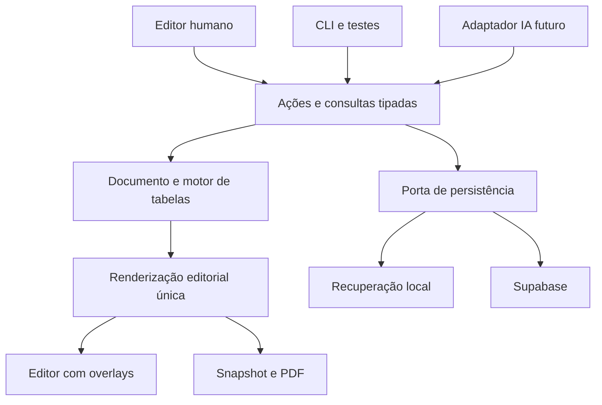

# Produto, arquitetura e contratos do documento

STATUS: PROPOSED
PRINCIPAL REVIEW: PENDING
FREEZE STATUS: NOT FROZEN
DATE: 2026-09-09

BASELINE: `616332d6048a4259d2e2b562d8d5e781cea334bd`

## Modelo de uso

Editor profissional de páginas finitas, com posicionamento livre entre objetos e layout previsível dentro de tabelas e caixas de texto. Um editor tipo Word simplifica fluxo longo, mas não resolve bem as composições Additel 875 p. 6. Um canvas infinito oferece liberdade, mas transfere ao usuário demasiada responsabilidade de impressão. A combinação proposta mantém a página física visível e oferece modelos prontos.

Fluxo principal: Meus catálogos → Novo a partir de modelo → Editar páginas → Conferir pendências → Salvar → Pré-visualizar → Baixar PDF. “Modelos” são páginas/catálogos editáveis; “estilos de tabela” só alteram aparência; “componentes” inserem composições reutilizáveis.

FATHER-USABLE V1 inclui texto rico, imagem, tabela, formas simples, linhas, grupos, estilos, presets/templates, Undo/Redo, recuperação local, salvamento remoto, PDF, AI Translation e basic read-only sharing. **Undo/Redo** e **local recovery** são `V1 DISPOSITION: MUST-CANDIDATE` / `DECISION STATUS: PROPOSED`: o primeiro garante reversão segura de ações editoriais e o segundo protege trabalho ainda não confirmado contra reload/crash/interrupção; nenhum deles é inferido de save/reopen. A experiência para usuário não técnico usa termos editoriais, sem exibir schema, resolver, binding, CAS ou IDs. FOUNDATION-PROOF-01 implementa apenas o subconjunto necessário para provar a fundação editorial e não é ainda essa experiência de produto.

## Canvas e interface propostos

- Barra superior: título, desfazer/refazer, status de salvamento, prévia e PDF.
- Trilho vertical: Selecionar, Texto, Imagem, Tabela, Formas, Componentes. Painel adjacente alterna Páginas/Modelos/Arquivos. Preservar paleta e identidade PRESYS; esta é uma proposta para a nova superfície, sem redesenhar o legado.
- Centro: página A4 com zoom ajustável e “Ajustar à página”. Sem largura fixa obrigando rolagem horizontal quando há espaço para reduzir o zoom.
- Inspector contextual: Conteúdo, Posição e tamanho, Aparência. Controles de fonte, cor e borda compartilhados, com extensões específicas da tabela.
- Seleção de objeto é distinta de edição de texto/célula. Escape termina edição antes de limpar seleção. Delete não remove um objeto enquanto o foco está editando texto.

| Interação | MVP | Regra |
|---|---|---|
| Selecionar/arrastar/redimensionar | MUST-CANDIDATE | Preview transitório; um comando no término; Escape cancela |
| X/Y/largura no inspector | MUST-CANDIDATE | mm finitos; conversão por zoom apenas na entrada/saída da UI |
| Altura | MUST-CANDIDATE | Frame é autoral. Em FOUNDATION-PROOF-01 tabela possui `frame.heightMm` fixo; altura intrínseca renderizada é métrica derivada e pode produzir overflow bloqueante |
| Ctrl/Cmd+Z, Shift+Ctrl/Cmd+Z | MUST-CANDIDATE | Uma transação editorial por Undo; não desfaz save remoto |
| Duplicar/copiar/colar | MUST-CANDIDATE | IDs novos; preservar referências internas remapeadas; dados técnicos intactos |
| Multi-seleção, alinhamento, distribuição | MUST-CANDIDATE | Somente objetos da mesma página; comandos atômicos |
| Grupo/desagrupar | MUST-CANDIDATE | Grupo plano de objetos; movimento conjunto, sem engine aninhado |
| Bloquear e ordenar camadas | MUST-CANDIDATE | Alteração de conteúdo de objeto bloqueado rejeitada; desbloqueio explícito |
| Snap e guias | MUST-CANDIDATE básico | Bordas/centros/margens; possibilidade de desligar; distância em tela é preferência de UI |
| Setas/modificador | MUST-CANDIDATE | Passo configurado de deslocamento físico; zero alteração dentro de input/célula |
| Marquee, réguas/guias persistentes | SHOULD | Não bloquear a primeira prova editorial |
| Rotação de tabelas, grupos aninhados, conectores inteligentes | LATER | Diagramas podem entrar como SVG seguro ou imagem na V1 |
| Pan e zoom | MUST-CANDIDATE | Preferências locais; não alteram documento ou PDF |

Nenhuma medição DOM cria páginas, move objetos, muda frames ou muda o dono de objetos. Sobreposição pode ser intencional e gera WARNING por padrão. Safe-area violation gera WARNING; sair dos limites físicos da página é ERROR. O usuário pode mover, ampliar, ajustar a tabela ou dividi-la somente por comando explícito.

## Estrutura proposta, ainda não criada

```text
src/vnext/
  domain/          document, rich-text, page, assets, style, table, invariants
  render/          document, page, primitives, table, preflight
  editor/          shell, application actions, tools, inspector, interaction overlays
  persistence/     ports, local recovery, Supabase adapter
  publication/     snapshots, manifest, render job
  presets/         brand defaults, table styles, starter compositions
  migration/       explicit legacy import, report, provenance
tests/vnext/       matching contract and browser tests
```

React/TypeScript/Vite permanecem. Zustand pode guardar estado de sessão; não é o contrato público do domínio. Supabase é adaptador de persistência, não uma dependência de tabela. Não criar `shared/` até existir reutilização concreta revisada.



Dependências: domain não importa React, DOM, Zustand ou Supabase. Render recebe dados/resolvers explícitos, não stores. Editor chama ações tipadas e ports; adapters são conectados em uma composition root. `migration/` pode ler schema legado; seu resultado é documento novo validado e relatório. O laboratório da foundation proof não pode virar um segundo engine permanente: se a prova receber GO, a fase seguinte começa promovendo/movendo o núcleo comprovado para `src/vnext/domain/`, `src/vnext/render/` e `src/vnext/editor/`.

Imports proibidos no runtime VNext: `useCatalogStore`, `useLibraryStore`, `ContentBlock`, `A4Canvas`, adaptadores de tabela legada, renderizadores especializados, presence legada. ESLint `no-restricted-imports` com overrides e verificação de grafo resolvido por TypeScript devem cobrir imports relativos e barrels. Um grep isolado não prova essa barreira.

## Geometria autoral — FOUNDATION REQUIRED, PROPOSED

O contrato de página abaixo é autoridade de autoria para FOUNDATION-PROOF-01 e base de FATHER-USABLE V1. Todos os IDs são opacos e estáveis. `widthMm`, `heightMm` e cada componente do frame devem ser finitos e positivos onde aplicável.

```ts
type CatalogDocument = {
  schemaVersion: 1;
  id: string;
  title: string;
  locale: string;
  style: DocumentStyle;
  pages: Page[];
  assets: AssetRef[];
  source?: { documentId: string; serverVersion: number };
};
type Page = {
  id: string;
  widthMm: number;
  heightMm: number;
  safeArea?: { topMm: number; rightMm: number; bottomMm: number; leftMm: number };
  objects: EditorialObject[];
};
type Frame = {
  xMm: number;
  yMm: number;
  widthMm: number;
  heightMm: number;
};
type EditorialObject = {
  id: string;
  type: ObjectType;
  frame: Frame;
  zIndex: number;
  locked?: boolean;
  // payload tipado por variante
};
// Cada variante inclui id, type, frame, zIndex e seu estilo validado.
// text: RichText + height:{mode:'auto'}|{mode:'fixed',mm:number}
// image: assetId + fit:'contain'|'cover' + focalPoint
// table: TableModel; frame.heightMm é autoral em FOUNDATION-PROOF-01
// shape: rectangle|ellipse + fill/stroke
// line: endpoints em mm + stroke; não depende de objetos-alvo na V1
```

Para FOUNDATION-PROOF-01 a página física alvo proposta é A4 retrato, `210 mm × 297 mm`. `safeArea`/margens são modeladas explicitamente e não alteram o tamanho físico. O valor legado `8.4667 mm`, derivado de 32 CSS px a 96 dpi, não é regra VNext nem default PRESYS; o default definitivo permanece PROPOSED/aberto para decisão editorial posterior.

Regra inviolável: **MEASUREMENT NEVER MUTATES AUTHORED FRAME.** Measurement pode medir, produzir métricas intrínsecas derivadas, diagnosticar e bloquear publicação. Measurement não pode alterar `xMm`, `yMm`, `widthMm` ou `heightMm`, mover vizinhos, criar página, mover objeto entre páginas, criar continuation page, reduzir fonte ou alterar conteúdo. Qualquer ajuste de frame é uma user command explícita e auditável.

`DocumentStyle`: famílias/fontes aprovadas com revisão, texto padrão em pt, paleta de cores e estilos nomeados com valores materializados. `AssetRef`: id, versão imutável/content hash, mime, dimensões, nome, alt; URL temporária não é identidade. `RichText`: parágrafos com IDs, runs com IDs e marcas bold/italic/sub/sup; quebras explícitas e listas simples. Runs de código técnico são protegidos; referências editoriais apontam para annotation IDs válidos do contrato D4. Não armazenar HTML arbitrário.

Resolver estilo: defaults do documento → estilo do objeto → overrides específicos. Tabelas detalham precedência própria. Font-size/borda em pt, dimensões e padding em mm, line-height como multiplicador; opacity entre 0 e 1. Cores RGB hex validadas ou token resolvido; sem CSS livre. Gradientes e sombras não bloqueiam FATHER-USABLE V1; somente entram após prova de impressão.

Regras: nenhuma referência quebrada; IDs únicos por documento; grupos só na mesma página, sem aninhamento ou membro em dois grupos; largura/altura positivas e finitas. Cruzar safe area gera WARNING sem reposicionamento; qualquer objeto fora dos limites físicos gera ERROR. Número da página é derivado da ordem, não persistido em textos fixos: usar campo dinâmico pageNumber/pageCount no renderer.

## Aritmética física determinística — FOUNDATION REQUIRED, PROPOSED

Toda geometria contratada usa milímetros na API/editor, mas cálculo e igualdade geométrica usam uma unidade inteira canônica. Definição: `PHYSICAL_UNIT_MM = 0.0001 mm` (um décimo de micrômetro; `10_000` unidades por mm). Essa escala preserva exatamente valores autorais com quatro casas decimais, inclusive o valor histórico `8.4667 mm` quando ele aparece como dado, é muito mais fina que a resolução física relevante de impressão/tela e mantém dimensões editoriais muito abaixo de `Number.MAX_SAFE_INTEGER` quando representadas como inteiros. Não usar `BigInt`, epsilon local ou acumulação binária em mm para decidir geometria.

Contrato canônico:

1. **Entrada de domínio:** campos públicos continuam em mm e devem ser `number` finito. `Column.flex.weight` é inteiro positivo seguro; peso fracionário não entra no solver canônico e deve ser normalizado por comando explícito antes dele.
2. **Representação interna:** `PhysicalLengthU` é inteiro seguro em unidades de `0.0001 mm`. Todas as somas, subtrações, limites, comparações e conservação do solver usam `U`. Toda soma/produto intermediário também deve permanecer `Number.isSafeInteger`; se não permanecer, retornar `PHYSICAL_ARITHMETIC_OVERFLOW / ERROR`, sem fallback float/BigInt local inventado pelo implementador.
3. **Conversão de mm autoral:** converter o `number` para sua representação decimal ECMAScript, inclusive forma exponencial quando produzida por `Number.prototype.toString`, interpretar os dígitos decimalmente e quantizar para `U` com **round half away from zero** na quinta casa decimal. É proibido `Math.round(mm * 10000 + epsilon)` ou epsilon equivalente. A quantização ocorre na fronteira de comando/importação; measurement nunca regrava frame autoral.
4. **Medição CSS:** fatos vindos do DOM devem ser lidos no espaço editorial não transformado. CSS px é convertido pela razão exata `1 CSS px = 127/480 mm`; aplicar a razão sobre a representação decimal do valor medido e então a mesma quantização para `U`. `devicePixelRatio`, zoom do editor e pixels físicos não participam.
5. **Arredondamento do solver:** divisões proporcionais produzem quociente inteiro por floor para a parcela base não negativa; o resto permanece inteiro e é tratado pela regra de resíduo abaixo. Nenhum arredondamento intermediário volta a mm.
6. **Conservação:** em sucesso, `sum(widthsU) === availableInnerWidthU` exatamente. Se mínimos/fixed excedem a largura, ou máximos impedem preencher a largura exata, retornar `TABLE_WIDTH_INFEASIBLE`.
7. **Resíduo determinístico:** depois de congelar colunas que atingiram `max`, calcular para cada flex elegível `q = floor(remainingU * weight / totalWeight)` e `r = (remainingU * weight) mod totalWeight`. Distribuir unidades residuais por `r` decrescente; empate pela ordem estável das colunas no modelo. Repetir após qualquer cap, nunca violar min/max. Se nenhuma coluna elegível puder receber o resíduo, falhar com `TABLE_WIDTH_INFEASIBLE`.
8. **Saída:** converter `U` para mm somente na API/renderização por divisão por `10_000`; serialização de evidência usa decimal exato com no máximo quatro casas. O vetor inteiro `widthsU` é a autoridade de igualdade.
9. **Igualdade em teste:** geometria normalizada é comparada por igualdade inteira exata; não existe epsilon. Para inputs idênticos, `widthsU` e sua serialização decimal devem ser idênticos independentemente de viewport, zoom ou renderer.

## Igualdade de layout e estabilidade — FOUNDATION REQUIRED, PROPOSED

`LAYOUT_UNSTABLE` compara snapshots de fatos físicos normalizados, nunca `DOMRect` bruto. O renderer produz uma coleção ordenada de `PhysicalLayoutFact`; cada dimensão/posição usa `PhysicalLengthU` do contrato acima. O conjunto mínimo, quando aplicável, é:

```ts
type PhysicalLayoutFact =
  | { kind:'page'; pageId:string; widthU:number; heightU:number }
  | { kind:'object'; pageId:string; objectId:string; xU:number; yU:number; widthU:number; heightU:number }
  | { kind:'table'; pageId:string; objectId:string; tableId:string; innerWidthU:number; renderedIntrinsicHeightU:number; columnWidthsU:number[] }
  | { kind:'row'; pageId:string; tableId:string; rowId:string; yU:number; heightU:number }
  | { kind:'cell'; pageId:string; tableId:string; cellId:string; xU:number; yU:number; widthU:number; heightU:number; intrinsicContentWidthU:number; intrinsicContentHeightU:number; textFlowSignature?:string }
  | { kind:'annotation'; pageId:string; tableId:string; annotationId:string; xU:number; yU:number; widthU:number; heightU:number; intrinsicContentHeightU:number; textFlowSignature?:string };
```

`textFlowSignature`, quando há texto que pode quebrar linha, representa a sequência ordenada de fragmentos de linha associada aos IDs/offsets semânticos do conteúdo e às suas caixas normalizadas em `U`; assim uma quebra de linha real não fica invisível só porque a altura externa permaneceu igual. Fatos são ordenados por `kind` e IDs estáveis, nunca por ordem incidental do DOM.

Após `required fonts loaded`, `required assets resolved` e `images decoded successfully`, o runner força a leitura de layout pela própria medição, captura snapshot A, executa preflight somente-leitura e captura snapshot B da mesma árvore/revisão/manifesto sem timer. **STABLE** significa: mesmo conjunto de chaves e igualdade exata de todos os inteiros, listas e `textFlowSignature` normalizados. Qualquer fato ausente/novo ou valor normalizado diferente é `LAYOUT_UNSTABLE / ERROR`. Ruído bruto inferior ao contrato só é estável quando normaliza para os mesmos fatos; não existe tolerância adicional. Mudança real de line flow, altura de row, dimensão intrínseca de imagem, métrica de fonte, bounds ou page assignment é instabilidade. `setTimeout`/sleep nunca prova estabilidade.

Cabeçalhos/rodapés no MVP são composições instanciadas a partir de template, com objetos bloqueados por padrão. Ao inserir/reordenar páginas, somente campos de numeração derivam. “Aplicar cabeçalho a páginas selecionadas” é comando explícito com preview, não vínculo vivo que altera tudo inesperadamente.

Documento NÃO guarda: seleção, hover, tab do inspector, drag parcial, zoom, canais, presence, status de save, DOMRect, altura medida ou caches. `schemaVersion`, revisão local de sessão e versão do servidor são conceitos diferentes.

## Ações, consultas, histórico

`execute(action, context)` é a única entrada de mutação. Context inclui documentId, principal/escopo e expectedLocalRevision; aplicação valida schema, alvo, permissões e invariantes antes de commit. IDs e relógio são injetados na aplicação; funções puras não geram Date.now/Math.random.

Resultado discriminado:

```ts
type Result =
  | { status: 'changed'; localRevision: number; createdIds: string[]; warnings: Diagnostic[] }
  | { status: 'noop'; localRevision: number }
  | { status: 'rejected'; code: string; targets: string[] }
  | { status: 'conflict'; expected: number; actual: number };
```

Famílias de ação: CatalogCreate/Rename/Duplicate; PageAdd/Delete/Reorder; ObjectInsert/Move/Resize/Delete/Duplicate; GroupCreate/Ungroup; SetText/SetImage/SetStyle; TableRow/ColumnInsert/Delete/Reorder, TableCellSet, Merge/Unmerge, ColumnResize, RowSizeSet, ApplyStylePreset, SplitTable; Undo/Redo. Futuro `FitTableHeightToContent` pode alterar `frame.heightMm`, mas somente como user command explícita. Payloads específicos por variante, sem `patch:any`.

Persistência e exportação são operações de aplicação próprias: Save, Recover, PreparePublication, Export. Nenhuma delas muda layout autoral. ImportDocument só aceita schema conhecido através da fronteira de importação; não existe ReplaceDocument público genérico.

Batch é atômico: falha em um comando rejeita todos. No-op não cria histórico, não incrementa revisão, não agenda save. Transação de arraste coalesce movimento; digitação coalesce por sessão de edição até blur/commit. Undo restaura estado anterior como nova revisão local e agenda save; não decrementa versão do servidor. Novo comando após Undo invalida o ramo redo.

Queries: getDocumentSummary, getPage, getObject, getTable, listAssets, listPresets e getDiagnostics retornam DTOs imutáveis. Leitura de seleção é UI, não documento. O adaptador de AI Translation exigido em FATHER-USABLE V1 e o futuro agente autoral autônomo usam consultas/ações limitadas, com identidades estáveis e conteúdo técnico protegido; nenhum deles participa de FOUNDATION-PROOF-01.

## Presets e componentes

Preset de estilo altera aparência, conservando IDs, conteúdo e geometria estrutural. Starter de tabela cria estrutura/células novas; no MVP só se insere como objeto novo. Aplicá-lo destrutivamente sobre tabela preenchida não é operação implícita.

Componente é composição copiada, com IDs remapeados, referências internas preservadas e `sourcePresetId/version` como proveniência. Edições posteriores não alteram o preset; “Salvar como componente” cria nova revisão. Instâncias vinculadas, grupos aninhados e atualização automática em todos os documentos ficam para depois.

A identidade visual PRESYS deve ser conservada e editável por tokens, não substituída por aparência Additel. Presets iniciais: capa institucional, ficha técnica densa, especificações lado a lado, acessórios/insertos e composição de pedido. A instituição também precisa de páginas narrativas com imagem e texto: o motor não deve virar apenas um gerador de planilhas.
