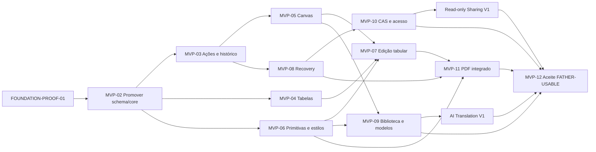

# Requisitos, ondas e critérios de aceitação

STATUS: PROPOSED
PRINCIPAL REVIEW: PENDING
FREEZE STATUS: NOT FROZEN
DATE: 2026-09-09

BASELINE: `616332d6048a4259d2e2b562d8d5e781cea334bd`

## Limite de escopo — PROPOSED

FOUNDATION-PROOF-01 é a prova proposta da fundação editorial e do PDF difícil antes de ampliar produto. Nessa prova, AI Translation, Sharing, PIM, Presence e AI authoring agent são OUT OF SCOPE. Isso não os classifica todos como pós-V1: para FATHER-USABLE V1, Catalog create/edit, Undo/Redo, local recovery, Save/reopen, PDF, AI Translation, Basic read-only sharing, Presets/templates e um único advanced table engine têm V1 DISPOSITION: MUST-CANDIDATE e DECISION STATUS: PROPOSED. Central PIM/product knowledge, Presence, realtime co-editing, autonomous AI catalog authoring e deeper workflow automation ficam POST-V1/LATER como proposta.

Não há prazo, custo, throughput ou limite de páginas prometido sem medição.

## Rastreabilidade

Todos os requisitos abaixo estão propostos e ainda não implementados no núcleo novo. Tests com prefixo G/T são critérios futuros, não testes já aprovados. Documentos D3/D4/D5 são os arquivos 03/04/05 desta pasta.

| ID | Requisito e origem | Contrato | Pacotes | Prova |
|---|---|---|---|---|
| PROD-01 | Catálogo institucional e técnico PRESYS; pedido direto | D3 | FATHER-USABLE V1 | G01–G05/T-FATHER |
| PAGE-01 | Página física explícita com frame autoral completo; measurement nunca muta autoria | D3 | FOUNDATION-PROOF-01 | T-PAGE/T-IMMUTABLE-01 |
| PAGE-02 | Duas/três tabelas independentes lado a lado; 875 p.6, Fluke p.4 | D3/D4 | 01,05,07 | G02/G03 |
| TABLE-01 | Motor único para todas as tabelas; legado + referências | D4 | 01,04,07 | T-IMPORT/G01–G05 |
| TABLE-02 | Merge, cabeçalhos agrupados, seções; 761 pp.3–4 | D4 | 04,07 | T-MERGE/G01 |
| TABLE-03 | Texto multilinha, código, unidade, sobrescrito; todas | D3/D4 | 02,04,07 | T-TEXT/G01 |
| TABLE-04 | Marcadores, imagens e legendas; 875 p.7, Europa p.2 | D4 | 04,06,07 | G04/G05 |
| TABLE-05 | Largura fixed/flex min/max, `frame.heightMm` autoral e RowHeightPolicy AUTO/MIN_MM/FIXED_MM | D4 | FOUNDATION-PROOF-01 | T-GEOMETRY/T-ROW |
| TABLE-06 | Annotations tipadas, referências válidas e divisão explícita por comando | D4 | FOUNDATION-PROOF-01 | T-NOTE/T-SPLIT |
| STYLE-01 | Tipografia, cores, bordas, padding editáveis; riqueza solicitada | D3/D4 | proof + FATHER-USABLE V1 | G01–G05/T-FATHER |
| UX-01 | Seleção, geometria, alinhamento, teclado e zoom | D3 | 05,07 | T-EDITOR |
| UX-02 | Undo/Redo e ações atômicas; confiabilidade do editor | D3 | FATHER-USABLE V1 MUST-CANDIDATE — PROPOSED | T-HISTORY |
| COMP-01 | Presets/templates reutilizáveis | D3 | FATHER-USABLE V1 MUST-CANDIDATE — PROPOSED | T-PRESET/T-FATHER |
| DOC-01 | Schema estrito, IDs estáveis e importação explícita | D3 | 02,03 | T-SCHEMA |
| PERSIST-01 | Salvar/reabrir, recuperação local, conflitos visíveis | D5 | local recovery: FATHER-USABLE V1 MUST-CANDIDATE — PROPOSED | T-RECOVERY/T-CAS |
| PUB-01 | PDF Chromium A4, mesma árvore screen/print, sem clipping/rasterização de página/tabela | D5 | FOUNDATION-PROOF-01 | T-PDF/T-PARITY-01/G01–G05 |
| PUB-02 | Exportar revisão identificada e manifesto de assets/fontes | D5 | 08,11 | T-SNAPSHOT |
| REL-01 | Erros explícitos e conteúdo pendente distinto de erro físico | D5 | 02,08,11 | T-PREFLIGHT |
| TEST-01 | Foundation goldens + aceite por usuário não técnico | D5/este arquivo | proof + FATHER-USABLE V1 | G01–G05/T-FATHER |
| AI-01 | Seam de ações/consultas para automação; agente autoral autônomo é POST-V1 | D3/D5 | POST-V1 | T-ACTIONS |
| MULTI-01 | Workspace/role/CAS; Presence/realtime co-editing POST-V1 | D5 | FATHER V1 base + POST-V1 realtime | T-TENANT/T-CAS |
| TRANS-01 | AI Translation com leaf IDs e proteção técnica | D3/D5 | FATHER-USABLE V1 MUST-CANDIDATE — PROPOSED | T-TRANSLATION/T-TEXT |
| SHARE-01 | Basic read-only sharing por snapshot revogável | D5 | FATHER-USABLE V1 MUST-CANDIDATE — PROPOSED | T-SHARE |

## G01–G05 — FOUNDATION REQUIRED, PROPOSED

| Golden | Fixture obrigatória | Aceite mínimo |
|---|---|---|
| G01 — DENSE GROUPED SPEC TABLE | 2+ header rows; grouped header; rowSpan; colSpan; measurements; units; multiline; thin borders | Estrutura tipada, spans válidos, medidas/unidades preservadas, bordas finas no PDF |
| G02 — THREE INDEPENDENT TABLES | Três table objects na mesma página A4; pelo menos duas lado a lado; frames independentes | Mudar A não altera frames B/C; nenhum flow/measurement reposiciona objetos |
| G03 — IMAGE / CAPTION / NOTES | Image cell; caption; multiline; long note; notes participam da geometria | Broken image = ERROR; annotations aparecem na página correta e entram em `renderedIntrinsicHeightMm` |
| G04 — MARKER / COMPATIBILITY MATRIX | Semantic marker type; matriz de compatibilidade | Marker não é arbitrary plain text only; semântica e legenda permanecem editáveis e preservadas |
| G05 — ADVERSARIAL | Long technical code; fixed row overflow; impossible columns; page bounds violation; safe area warning; asset failure; font failure; geometry stability | Cada falha produz severidade/código esperados; nenhum auto-fix oculto; código adversarial permanece byte-for-byte semanticamente igual |

Não reduzir linha/coluna/célula, fonte ou frame para fazer golden passar. Fixtures iniciais podem usar textos sintéticos identificados; liberação comercial usa dados PRESYS conferidos. Não usar print do concorrente como fundo nem toda a tabela como imagem. Em G05 o `technicalCode` usa `wrapPolicy = nowrap` e `06.04.0121-00/IN1P/TA-50N-NH-PB-XXXXXXXXXXXX`; falta de espaço é diagnóstico, nunca alteração semântica.

Golden visual inicial deverá ser aprovado por inspeção do resultado em tela e impresso a 100%. Após aprovação poderá virar baseline de regressão. Screenshot não prova conteúdo: contar linhas/células/notas, extrair texto e comparar manifesto. Diferenças visuais têm tolerância calibrada no ambiente de execução; não inventar percentual de diff universal.

## Ordem de implementação

| Onda | Pacotes | Resultado verificável |
|---|---|---|
| O0: reduzir risco editorial | FOUNDATION-PROOF-01 (filename histórico MVP-01) | Prova local CLI → Chromium PDF com G01–G05, sem implementar produto completo |
| O1: promover o núcleo comprovado | MVP-02/03/04 | Começar movendo/promovendo o core aprovado do lab para `src/vnext/domain/`, `src/vnext/render/`, `src/vnext/editor/`; um engine only |
| O2: editor útil | MVP-05/06/07 | Objetos e tabelas ricos, posicionamento e edição coerentes |
| O3: durabilidade e produto | MVP-08/09/10 | Recovery, biblioteca/modelos e salvamento autenticado |
| O4: FATHER-USABLE V1 | MVP-11/12 + stories executáveis de AI Translation e basic read-only sharing | PDF integrado, Undo/Redo, local recovery, save/reopen, presets/templates, tradução IA protegida, sharing read-only e tarefa real por usuário não técnico |
| POST-V1 | PIM central, Presence, realtime co-editing, autonomous AI authoring, deeper workflow automation | Incrementos através dos seams previstos, sem contaminar a foundation proof |

Se FOUNDATION-PROOF-01 receber GO, MVP-02 não reimplementa o motor: começa promovendo/movendo o núcleo comprovado do lab para o namespace VNext real. É proibido deixar `src/labs/presys-editorial-proof/` e um segundo production VNext engine evoluírem em paralelo. 03 e 04 podem ser paralelos após essa promoção; 10 exige revisão de banco/segurança própria antes de migração. Não há autorização de deploy/migração derivada deste roteiro.

## Backlog delimitado para os próximos agentes

Somente FOUNDATION-PROOF-01 está detalhado como pacote executável completo em `tasks/` (filename histórico MVP-01). Os demais itens abaixo são backlog PROPOSED com escopo e aceite, a detalhar com SHA real dos predecessores. FATHER-USABLE V1 não pode ser declarado completo sem stories executáveis e aceitas para AI Translation e basic read-only sharing.

| Pacote / risco | Escopo permitido e interfaces | RED/aceite e limite |
|---|---|---|
| MVP-02 / alto | Promover o núcleo aprovado do lab para `src/vnext/domain/`, `src/vnext/render/`, `src/vnext/editor/`; CatalogDocument, Object, RichText, assets e parser | Nenhum lab engine paralelo; duplicidade, NaN, referência quebrada e schema futuro rejeitados; roundtrip mantém IDs/decimais; não importa runtime legado |
| MVP-03 / alto | `application/actions`, `transactions`, `history`, `queries`; execute/query e Result | Alvo errado/no-op/batch parcialmente inválido; Undo/Redo exatos, stale revision rejeitada; nenhuma persistência embutida |
| MVP-04 / alto | `src/vnext/domain/table/`; model, operations, validation e `resolveColumns`; contrato D4 | Spans/coveredBy, inserção, limites, zero width, overflow e perda de conteúdo; geometry resolver reimplementado from lessons |
| MVP-05 / médio após contratos | `editor/canvas`, `editor/interaction`; action dispatcher e frames | Drag em zoom diferente, cancelamento, teclado em célula e múltiplos objetos; commit único, sem escrita por DOM |
| MVP-06 / médio | `src/vnext/render/primitives`, `presets/brand`, controles de estilo; manifesto de fontes/assets | Texto rico/imagem/forma/linha em editor e print iguais; glyph ausente falha; não criar renderer por modelo de catálogo |
| MVP-07 / alto | `src/vnext/editor/table`, `src/vnext/editor/inspector/table`, `src/vnext/render/table`; motor D4 | G01–G05 editáveis; merge/annotation/overflow visíveis; TSV determinístico, sem sobreposição parcial de merges |
| MVP-08 / alto | `persistence/local`, sessão e recovery; checkpoint e ACK da revisão | Crash/reopen, quota, troca de usuário, ACK tardio; preservar dirty e assets; sem prometer offline multiusuário |
| MVP-09 / médio | `editor/library`, `presets`; repository port e instanciador | Criar/abrir/duplicar catálogo/template; IDs remapeados; editar instância não muda preset; ainda pode testar repo fake |
| MVP-10 / alto | `persistence/supabase`, testes de integração e migrações aprovadas separadamente | Dois clientes salvando N: só um vence; tenant B negado; idempotência; não reutiliza tabelas legadas como autoridade |
| MVP-11 / alto | `publication/`, `src/vnext/render/preflight`, integração UI; snapshot/manifest/export port | Edição durante export, imagem lenta/quebrada, fonte ausente, `LAYOUT_UNSTABLE` e conteúdo fora da página; PDF Chromium identificado, mesma árvore/frames |
| MVP-12 / revisão humana | `tests/vnext/browser`, goldens e registro de aceite; inclui verificação das stories V1 de tradução/sharing | Usuário não técnico executa jornada completa FATHER-USABLE; Undo/Redo e recovery local funcionam; reabre igual; quatro gates; tradução IA e sharing read-only presentes; sem pendências bloqueantes |

Cada novo pacote deve especificar arquivos exatos dentro dessas áreas, contratos já existentes, comandos focados, efeitos permitidos e artefatos esperados. Qualquer necessidade de mudar domínio, migração ou interface pública sai da categoria de implementação rotineira.

## Aceite do usuário final

Com dados PRESYS conferidos e modelo editorial pronto, a pessoa:

1. Cria catálogo e escolhe capa/página técnica.
2. Coloca três tabelas independentes; ajusta largura, coluna e densidade.
3. Insere linha, mescla cabeçalho, adiciona foto e nota referenciada.
4. Altera código/valor sem normalizar precisão involuntariamente.
5. Move e alinha objetos; desfaz/refaz sem perda.
6. Salva, fecha e reabre; conteúdo e composição permanecem.
7. Identifica e resolve uma célula transbordando e uma imagem ausente.
8. Baixa PDF; confere páginas, símbolos, bordas e imagens; imprime uma folha a 100%.
9. Solicita AI Translation; códigos, números/unidades, normas e modelos permanecem protegidos; revisa o resultado antes de aceitar.
10. Publica basic read-only sharing da revisão escolhida e consegue revogar o acesso sem alterar o documento autoral.

Registrar assistência necessária, erros, duração observada e dúvidas. Não há limite arbitrário de minutos. “MVP impecável” vira essas provas observáveis, não promessa de ausência absoluta de bugs.

## Performance e não regressão

Ensaiar 1 página difícil e catálogos de 20 e 50 páginas como cenários, não limites de produto. Medir tempo de abrir, edição de célula, resposta do arraste, uso de memória, exportação e tamanho do PDF no computador real. Virtualizar páginas fora de vista no editor depois de medir; nunca excluir conteúdo da exportação para otimizar.

Durante a transição o legado pode seguir disponível para fluxos ainda não promovidos, mas FATHER-USABLE V1 só recebe esse nome quando Undo/Redo, local recovery, AI Translation e basic read-only sharing estiverem presentes junto de create/edit, save/reopen, presets/templates, advanced table engine e PDF. Undo/Redo e local recovery são MUST-CANDIDATE — PROPOSED; recovery protege trabalho entre saves confirmados, não é sinônimo de save/reopen. PIM central, Presence, realtime co-editing, autonomous AI authoring e deeper workflow automation permanecem POST-V1.
